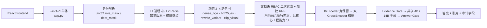
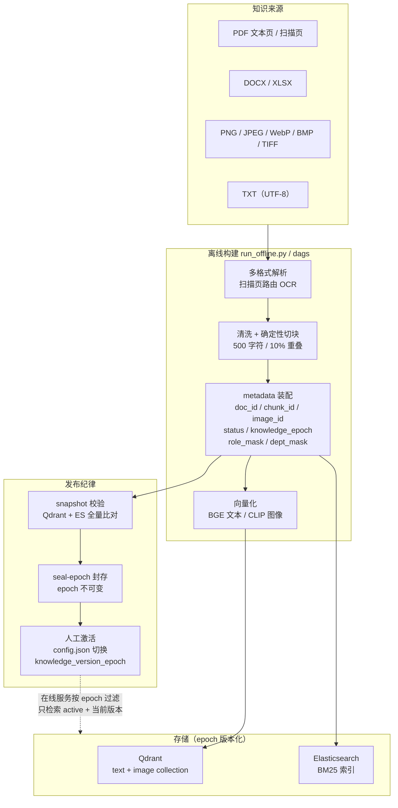

# 化妆品行业 RAG 问答系统 · Cosmetics Industry RAG QA System

> **一句话**：企业内部多模态 RAG 问答系统——把散落在 PDF、图片、表格里的化妆品法规 / 成分 / 产品知识变成可检索资产，在线返回**带引用、带出处、证据不足就拒答**的答案，并按角色与部门做权限隔离。
>
> **不是普通向量检索 Demo 的地方**：在线链路是**动态 2–4 路召回 → 两级重排 → Evidence/Answer 双 Gate 拦截幻觉 → RBAC 纵深防御 → 4B/14B 模型路由**；离线侧是**多模态解析 + 知识版本封存 / 人工激活**的分发布纪律。
>
> **本仓库附带证据治理能力**：每条能力都带 canonical 证据等级，`scripts/check_repo_consistency.py` 在 CI 中拦截该守卫覆盖的口径漂移（证据等级越界、文档链接与路径失效、枚举与 SLO 计数对不上、引用不存在的指标 series）。它只校验可机械判定的契约，**不判断任意自然语言陈述的真实性**。

[](LICENSE)


[](https://github.com/Xander-Xai/Beauty-Industry-RAG-QA-System/actions/workflows/ci.yml)
[](https://github.com/Xander-Xai/Beauty-Industry-RAG-QA-System/actions/workflows/lint.yml)
[](https://github.com/Xander-Xai/Beauty-Industry-RAG-QA-System/actions/workflows/security.yml)

三个徽章是 GitHub Actions 动态徽章，直接读取 `main` 上的真实运行结果；工作流定义见 `.github/workflows/`。Runtime version `2.3.0`（`config.json` → `system.version`）。

---

## 企业场景

**业务问题**：化妆品行业的法规、成分、产品资料分散在 PDF 扫描件、成分表图片、Excel 规格表和内部 Word 手册里。法规专员、注册申报、市场和客服各自只该看到职责范围内的内容，而同一个问题（例如「某成分在儿童化妆品中的限量」）对不同角色的答案必须一致、可追溯到具体条款。

**三类约束决定了这必须是 RAG 而不是微调**：

| 约束 | 现实 | 对系统的要求 |
|---|---|---|
| 知识频繁更新 | 法规修订、限量调整、产品迭代 | 知识必须可版本化、可回滚，不能焊进模型权重 |
| 答案必须可追溯 | 内部业务结论要能落到具体文档与条款 | 每个结论都要能指回原文，证据不足必须拒答 |
| 可见性按角色收窄 | 配方、竞品、薪酬等文档按角色与部门隔离 | 过滤必须发生在**存储侧下推 + 融合前**，不能只靠生成时约束 |

**四条用户主链路**：法规问答（「这个成分在中国备案有什么限量要求」）、成分/产品检索（「含视黄醇的产品线有哪些」）、图片检索与图文互查（成分表照片 → 对应文档）、多轮追问（同一话题继续深挖，复用已锁定的证据）。

**为什么需要 RAG**：这些问题要求的是**查得到原文**而不是记住答案。法规限量数字变了，模型权重里的旧数字不会自己更新；答案要能被法务复核，就不能是模型「觉得」的内容。RAG 把「知识时效」「可追溯性」「按权限隔离」三件事放到检索与证据层解决，把 LLM 限制在它擅长的地方——在给定证据内组织语言。

---

## 30 秒读懂

| # | 问题 | 答案 | 工程入口 |
|---|---|---|---|
| 1 | **这是干什么的** | 把法规 / 成分 / 产品知识建成可检索资产，在线回答带引用的领域问题，证据不足就拒答 | [Architecture](#architecture) |
| 2 | **解决什么业务问题** | 知识散在 PDF、图片、表格里，人工检索慢且回答容易编造；不同角色该看到的内容也不同 | [企业场景](#企业场景) · [核心工程能力](#核心工程能力5-项) |
| 3 | **核心架构** | FastAPI 单体主链路；动态 2–4 路召回 + 加权 RRF、BiEncoder/CrossEncoder 两级重排、Evidence Gate + Answer Gate 双门控、4B/14B 路由 | [Architecture](#architecture) · [docs/architecture-baseline.md](docs/architecture-baseline.md) |
| 4 | **企业工程化** | RS256 认证 + uint32 位掩码 RBAC（存储下推 + 融合前二次过滤 + 缓存物理分区）、结构化业务动作审计、Prometheus 指标与告警规则、SLO/故障 Runbook、Docker Compose + Kubernetes 双形态 | [docs/operations-guide.md](docs/operations-guide.md) · [docs/slo-runbook.md](docs/slo-runbook.md) |
| 5 | **怎么跑** | `pip install -r requirements.txt && cp .env.example .env && python3 app.py` → `http://localhost:8000/docs` | [Quick Start](#quick-start) |
| 6 | **已验证 / 未验证在哪看** | 边界一节讲清：[Evidence Boundary](#evidence-boundary)；逐项「已实现 / 未验证 + 升级判据」见 [Production Readiness](#production-readiness) | [docs/production-readiness.md](docs/production-readiness.md) |
| 7 | **历史生产规模** | `HISTORICAL_PRODUCTION`，**不是本仓库 benchmark** | [Evidence Boundary](#evidence-boundary) |
| 8 | **已知未收敛的实现细节** | RRF 融合当前执行两次 · 六个微服务目录中 5 个按现状不可启动 · 无 CrossEncoder 权重时全链路拒答 | [核心工程能力 1](#核心工程能力5-项) · issue [#84](https://github.com/Xander-Xai/Beauty-Industry-RAG-QA-System/issues/84) |

---

## Architecture

> 当前已验证架构是 **FastAPI 单体主链路**，不是已完成联调的微服务架构。完整事实基线（唯一的架构口径来源）见 [docs/architecture-baseline.md](docs/architecture-baseline.md)。

### 在线检索链路



上图为**第一屏简化视图**。完整 canonical 架构图（含 Qdrant / Elasticsearch / Redis / vLLM 依赖与离线链路）见 [docs/architecture-baseline.md](docs/architecture-baseline.md)。

### 数据流程：离线知识构建 → 存储 → 在线检索



三个容易被忽略的点：

1. **切块是确定性的**，不是模型切分：500 字符窗口 / 10% 重叠，边界由字符位置决定，同一输入永远得到同一批 `chunk_id`——这是 epoch 可比对、可回滚的前提。
2. **逻辑身份与物理身份分离**：`doc_id` / `chunk_id` / `image_id` 是稳定逻辑身份，Qdrant point ID 按 epoch 版本化，因此同一份文档可以在新旧版本中并存而不冲突。
3. **激活是人工步骤**。构建、校验、封存可自动化，但把 `config.json` 的 `knowledge_version_epoch` 切到新版本必须由人执行；调度器**从不**自动激活。DAG 代码存在不等于调度器在运行。

`offline/` · `run_offline.py` · `dags/` · 操作细节见 [数据管理手册](docs/data-admin-guide.md)

**微服务目录的状态**：`api-gateway/`、`retrieval-service/`、`generation-service/`、`monitoring-service/`、`cache-service/`、`rewrite-service/` 是保留的代码组件，**不代表**已与当前前端完成端到端生产验证；当前默认主线是上面的单体应用。已知边界：这 6 个目录中**只有 `api-gateway` 能被导入**，另外 5 个的 `main.py` 只把项目根加入 `sys.path` 却以裸顶层名导入同级模块，在其 `docker-compose.microservices.yml` 给定命令下直接 `ModuleNotFoundError`（见 [Production Readiness](docs/production-readiness.md#microservice-components) 与 issue #84）。

---

## 核心工程能力（5 项）

> 每一项的等级都是 `REPO_VERIFIED`（代码 + 确定性测试覆盖），**不是** `LOCAL_REAL_VALIDATION`，更不是生产验证。逐项的等级、代码位置、测试位置与升级路径见 [Evidence Boundary](#evidence-boundary) 与 [docs/evidence-map.md](docs/evidence-map.md)。

### 1 · 动态 2–4 路召回 + 两级重排，而不是固定四路

简单问题 2 路（`dense_bge` + `bm25_es`）；复杂问题 +1 路 `rewrite_variant`；复杂且视觉相关再 +1 路 `clip_visual`。ES Fallback 是降级补召回，不算一路。融合后 BiEncoder 宽保留 Top 150，再由双 CrossEncoder ensemble 精排到 Top 10（请求内批量预测）。加权 RRF 按问题类型调整权重：法规类提高 BM25，视觉类提高 CLIP。

**一处必须说清的代码事实**：加权 RRF 目前执行了两次，而不是一次。第一次在 `retrieval/parallel_recall.py`，权重是**查询感知**的（法规类 BM25 1.5、视觉类 CLIP 2.0）；第二次在 `core/pipeline.py` 的 `_merge_and_dedup`，权重换成与查询无关的 `w_text` / `w_clip` / `w_ocr`（按 `embedding_type` 分流），并会重新排序。该函数上方第 429 行的注释写的是「RRF 已在并行召回管理器中完成」，与其函数体矛盾——**注释与实现不一致，以实现为准**。第二次融合会部分抵消第一次的查询感知加权。这是已知缺陷，已跟踪在 #84，计划收敛为「加权 RRF 只在 `parallel_recall` 内发生一次，`_merge_and_dedup` 退化为纯去重」。
`retrieval/parallel_recall.py` · `retrieval/bi_encoder.py` · `retrieval/cross_encoder_ensemble.py` · `core/pipeline.py`

### 2 · 双 Gate 把幻觉关在门外

生成前 **Evidence Gate** 综合 Top 1 / Top 3 / 多路一致性 / 文档间一致性，输出「正常生成 / 增强证据后生成 / 拒答」；生成后 **Answer Gate** 校验答案与核心证据一致性，法规类矛盾直接拒答。拒答是业务需求，不是装饰。
`retrieval/evidence_gate.py` · `retrieval/answer_gate.py`

### 3 · 权限与信任边界都是纵深的——但只是纵深防御

存储侧下推（Qdrant 下推文档状态与知识版本；ES 下推状态、版本、role、dept）+ 融合前 uint32 位掩码 RBAC 二次过滤；Redis L2 物理 key 按 `rag:l2:rm:{role_mask}:dm:{dept_mask}:{key}` 分区，由 cache 对象自身强制，旧的无分区 key 不回落（宁可 miss）。签名有效只证明 token 来自持钥方；畸形授权声明 **fail closed**。认证以 RS256 为准，旧 HS256 `JWT_SECRET` 仅为可选兼容回退。登录限流 5 次/分钟，仅当 TCP 对端属于 `TRUSTED_PROXIES` 时才解析 `X-Forwarded-For`（`app.py` 设 `proxy_headers=False`，使应用策略具备权威性）。

检索证据按不可信数据处理：保留标记集中定义并在所有不可信通道转义，证据被限定在 `<retrieved_context>` 数据区块内、当前请求在 `<user_query>` 区块内。这是 **prompt 层结构约束，不是强隔离**——它不解决 prompt injection，也不能证明越狱不可能；同样不代表 RBAC 已在生产环境验证。
`common/auth.py` · `api/routes_auth.py` · 逐项控制、测试与仍然开放的缺口见 [docs/security-regression-coverage.md](docs/security-regression-coverage.md)

### 4 · 离线知识构建与在线检索分离，知识版本有发布纪律

多格式解析：UTF-8 TXT、PDF（文本页 + 扫描页 OCR 路由）、DOCX、XLSX，以及独立图片（PNG/JPEG/WebP/BMP/TIFF）。确定性切块默认 500 字符 / 10% 重叠；`doc_id` / `chunk_id` / `image_id` 为逻辑身份，物理 Qdrant point ID 按 epoch 版本化。增量状态检测以内容哈希为准（不是 mtime/size 短路）、snapshot carry-forward、全量重建、快照校验、epoch 封存。反馈闭环统一 review 门控，只有 `accepted` 记录进入训练导出。

构建 / 校验 / 封存（seal）可自动化，但**激活 `knowledge_version_epoch` 是显式人工步骤**；封存后 epoch 不可变，`--skip-validation` 是明确的危险逃生口。cron / Airflow / CLI 共用同一业务逻辑，调度器**从不**自动激活 epoch——DAG 代码存在不等于调度器在运行。
`offline/` · `run_offline.py` · `dags/` · 操作细节见 [数据管理手册](docs/data-admin-guide.md)

### 5 · 仓库自身的证据治理

一套 canonical 证据等级把「设计目标 / 已实现 / 本地真实验证 / 历史生产」在文档层面隔离，并由 `scripts/check_repo_consistency.py` 在 CI 里强制：不得把设计目标写成实测、不得引用不存在的指标 series、不得把 RAGAS 缺失写成零分、不得把未测量写成 `0`。上述被守卫覆盖的漂移会在 CI 里被拦截；守卫校验的是这些可机械判定的契约，不判断任意自然语言陈述的真实性。

运维侧只认真实存在的东西：`/api/metrics`（需认证）、6 条只引用真实 emit 指标的 Prometheus 告警规则、10 面板 Grafana JSON、9 字段结构化业务动作审计（Redis Stream + 每日 JSONL）、按代码中真实存在的降级路径编写的 SLO + 故障 Runbook，以及**已实现但默认关闭**的 OTLP exporter。

---

## 一次请求长什么样（合成数据演示）


五段链路：**用户 Query → 回答（内含〔证据N〕引用）→ 引用证据标签（可点，命中来源文档）→ 来源文档条款 → 权限 / 可信证据**。第二问是切换身份之后的同一问题：`Regulatory Affairs`（role_mask=0x04 · dept_mask=0x04）读得到 ④ 里那两份文档，两份的掩码都是 0x04 / 0x04；切到 `Commercial Team`（0x08 / 0x08）后两份都被权限过滤掉、证据为空，系统拒答而不是编一个答案。

这处对照不是口头承诺：合成语料里每份文档的 `role_mask` / `dept_mask` 都由 `tests/test_demo_corpus_rbac_consistency.py` 用**真实的 `common.auth.is_allowed`** 逐份校验，mock 也按同一谓词逐份过滤，不会端出当前身份打不开的引用。这只证明演示数据与仓库的权限语义自洽，**不构成 RBAC 的运行时验证**。

这张图的边界：左侧是真实 UI（`frontend/src/App.jsx`，由 Playwright 驱动真实输入与点击），后端是 `docs/demo/mock_api.py` 这个合成 mock；右侧两张卡片是演示标注，不是产品界面；全部数值是合成的（`docs/demo/synthetic_corpus.json`）——虚构文档号、占位 CAS 号、杜撰标准名，不含真实法规结论、历史生产语料、生产日志、凭据或流量数据。复现命令 `python3 docs/demo/capture_demo.py`（说明见 [docs/demo/README.md](docs/demo/README.md)）。本仓库**没有**公网 Demo 与演示视频，因此没有 Demo 链接可点。

---

## Evidence Boundary

这一节回答两个问题：**哪些结论本仓库能证明，哪些不能**。完整逐条表格（能力 / 等级 / 代码证据 / 测试证据 / 升级路径）在 [docs/evidence-map.md](docs/evidence-map.md)；实现与证据状态的完整审计在 [docs/repository-truth-audit.md](docs/repository-truth-audit.md)。本节是摘要，只出现一次。

### Canonical 证据等级

全仓库只用下面六级，与 [docs/evidence-map.md → Classification vocabulary](docs/evidence-map.md#classification-vocabulary) 完全一致；`EXECUTED` / `PARTIAL` / `BLOCKED` / `PASS` / `NOT RUN` 是**单次运行结果**，不是证据等级，永不出现在证据等级列。

| 等级 | 含义 | 可以这样说 | 不能这样说 |
|---|---|---|---|
| `HISTORICAL_PRODUCTION` | 前雇主生产环境实际做过的工作；专有资产不在本仓库 | "我在上一套生产系统里……" | "本仓库证明了这个规模" |
| `HISTORICAL` | 本仓库内被取代、只为追溯保留的实现 / 配置 / 设计 | "这是被取代的仓库路径，保留作为历史上下文" | "这是当前生产能力" |
| `REPO_VERIFIED` | 代码/配置存在，并被本仓库收集到的确定性测试或 CI 覆盖 | "已实现且有测试覆盖" | "已通过生产验证" |
| `LOCAL_REAL_VALIDATION` | 用真实外部依赖在单台本地主机上跑过 | "在本地对真实依赖验证过" | "生产集群 / HA / SLO 已验证" |
| `DESIGN_TARGET` | 写进文档的目标 / 设计；无实现或无可复现 benchmark | "设计目标是……" | "运行中的系统达到……" |
| `PENDING` | 代码可能在，但验证所需的真实资产 / 运行时 / 凭据在此不可得 | "已实现，真实验证待补" | "已经验证过了" |

`HISTORICAL` 与 `HISTORICAL_PRODUCTION` 不可互换：前者说的是本仓库自己的历史代码，后者说的是历史生产系统，两者都不是当前能力。

### Historical Production Context

> 等级 `HISTORICAL_PRODUCTION`。下表全部是**历史生产环境**的业务规模与流量背景。本公开仓库**不包含**对应的专有语料、生产日志、模型权重、监控数据或流量切分配置，因此这些数字**不是** `REPO_VERIFIED`，**不是**本仓库的 benchmark，**也无法由本仓库复现**。

| 维度 | 历史生产环境事实 |
|---|---|
| 知识资产 | 3000+ 文档 · 5000+ 图片 · 1500+ 产品 · 2000+ 成分 · 8 大法规体系 |
| 用户与流量 | 200+ 内部用户 · 高峰短时 10–15 QPS · 日均 1500+ 请求 |
| 生产推理硬件 | RTX A5000 ×2 |
| 后续模型迁移 | Qwen2.5 → Qwen3-14B / Qwen3-4B 灰度迁移验证 |
| 公司认可 | 年度技术创新奖 |

三条不可跨越的边界：**不得**把上表任何一项归类为 `REPO_VERIFIED`；**不得**用历史生产经验替代仓库验证——`config.json` 里 4B / 14B vLLM 拓扑**在本仓库从未执行过**（权重缺失、`vllm` 未安装），该项为 `PENDING`；**奖项不是运行时验证**，它不携带关于本仓库延迟、吞吐或正确性的任何证据。

### 框架已实现 ≠ 结果已产出

这是本仓库最重要的一张表。**每一行都是"实现"与"结果"分开的**：

| 能力 | 实现 | 结果 | 缺什么才能升级 |
|---|---|---|---|
| 检索 benchmark（Recall/HitRate@1/3/5/10、MRR@10、NDCG@10） | `REPO_VERIFIED` | `PENDING` | 一次真实 ES/Qdrant 运行并提交可复现 artifact（含 `git_sha` / 数据集 sha256 / 模型 revision / 硬件 / 样本数 / 延迟 / 命令 / 限制说明，见 [验收标准](docs/evidence-map.md#benchmark-artifact-acceptance-criteria)） |
| 性能产物契约（七文件、未测量即 `null`） | `REPO_VERIFIED` | `PENDING` | 对真实 API + LLM + 检索栈执行既定负载并提交一份 artifact |
| QPS / 延迟数字 | — | `PENDING` | 同上：**本仓库没有可复现的 QPS / 延迟 benchmark 结果** |
| SLO 目标（5 个）与告警阈值 | `REPO_VERIFIED`（文档 / 配置） | `DESIGN_TARGET` | 在真实环境达成该目标 |
| Prometheus 告警（6 条） | `REPO_VERIFIED`（配置） | `PENDING`（生产触发） | 一个真实 Prometheus 实例加载并触发这些规则 |
| Grafana 仪表盘（10 面板） | `REPO_VERIFIED`（JSON） | `PENDING` | 导入运行中的 Grafana 并确认面板被真实数据填充 |
| OTLP exporter | `REPO_VERIFIED`（实现，默认关闭） | `PENDING`（运行期闭环） | 应用 → exporter → collector → 后端 → 真的查到 span |
| RAGAS 质量分 | `REPO_VERIFIED`（harness） | `PENDING` | 获批 evaluator provider + API key + 一次真实运行 |
| BGE / CLIP / PaddleOCR 真实模型 | `REPO_VERIFIED`（adapter 契约） | `PENDING` | 真实权重与运行时的 smoke（当前 `EXTERNAL_MODEL_ASSET_REQUIRED`） |
| 4B / 14B vLLM GPU 拓扑 | `REPO_VERIFIED`（路由契约） | `PENDING` | 真实 GPU 部署与压测（权重不在仓库，`vllm` 未安装） |
| QLoRA 微调 | `REPO_VERIFIED`（工具） | `PENDING` | 可复现训练运行 + adapter 产物 |
| Airflow 调度 | `REPO_VERIFIED`（DAG 注册） | `PENDING` | 真实 Airflow DAG 执行 |
| Qdrant 真实服务 | `REPO_VERIFIED`（当前回归覆盖 = 进程内 `QdrantClient(":memory:")`） | `PENDING`（真实服务 artifact） | 一次新的真实服务运行并提交产物。**开发沿革中确有 PR #6/#7 的真实本地 Qdrant + ES 集成运行记录，但那不是可复现 artifact**——两个方向都不能说错，详见 [Qdrant evidence: two states](docs/evidence-map.md#qdrant-evidence-two-states-kept-apart) |
| 微服务（六个目录） | `REPO_VERIFIED`（组件） | `PENDING`（集成部署） | 与当前前端的端到端生产验证 |
| 前端 CI 构建（`npm ci` + `npm run build`） | `REPO_VERIFIED` | —（构建产物不发布） | 无需升级：这是门禁，不是结果。**但构建成功只证明 bundle 能编译** |
| 前端 + 真实后端端到端运行 | `REPO_VERIFIED`（客户端与 API metadata 契约） | `PENDING` | 一次真实浏览器运行：`frontend/` 对真实单体 + 真实 ES/Qdrant + 真实模型。首屏那张图由 Playwright 驱动**真实 UI**、后端为合成 mock，属演示产出而非后端集成证据 |
| 前端生产部署 | —（部署态在本仓库之外） | `PENDING` | 一次真实部署并记录环境。这是 deployment-specific 状态，本仓库不断言 |

### 本地真实验证（`LOCAL_REAL_VALIDATION`，只有这 5 项）

在本地单主机 + 真实依赖上实际跑过，证据见 [docs/validation/v2.5-runtime-security-validation.md](docs/validation/v2.5-runtime-security-validation.md)：

1. Redis 7.4.9 多进程会话持久化（进程 A 写入 → 进程 B 类型化恢复 → 进程 C 观察到更新 → TTL 刷新）
2. Redis 跨进程登录限流（跨两进程交替第 6 次 429、窗口过期、Redis 挂掉时降级单进程内存）
3. 真实 nginx 单跳与多跳 `TRUSTED_PROXIES` 客户端 IP 解析
4. 认证 Elasticsearch 8.11（匿名/错误凭据 401、writer mapping + `search_after`、在线 BM25 检索）
5. 带 Bearer token 的 Prometheus 抓取（无 token 401、Bearer 200、target `up == 1`）

**这不等于生产集群验证**：Redis Cluster/Sentinel、云负载均衡拓扑、多节点 ES/TLS、长期 Prometheus/Grafana 运维、生产 HA/SLO，以及 4B/14B vLLM GPU 部署，均未在本仓库验证。

### 数值口径

- **性能数字**只允许在三种语义下出现：`HISTORICAL_PRODUCTION`（上表）、`DESIGN_TARGET`（SLO / 告警阈值）、或合成 demo 夹具值；**均不得表述为本仓库实测结果**。
- 排障时引用的 `rag_*` 指标必须真实存在。exporter 只暴露原始计数器与直方图（例如 `rag_cache_hit_L1`、`rag_cache_total`、`rag_evidence_score_seconds`），**没有** `rag_cache_hit_rate` 或 `rag_rewrite_fallback_rate` 这类 series；比率要么用基于已 emit counter 的 PromQL ratio，要么读 `/api/stats` 的计算字段。`scripts/check_repo_consistency.py` 强制这条契约。
- 本仓库唯一的告警契约是 [`monitoring/prometheus/alerts.yml`](monitoring/prometheus/alerts.yml)，由外部 Prometheus 加载评估。`monitoring/otel_tracer.py` 里还有一个更早的进程内 `AlertingManager`，**没有**接入 canonical 请求路径，属于遗留代码，喂给它的 `config.json` → `alerting.rules` 配置块也已移除。
- `/api/stats` 与 `/api/metrics` 需要身份认证（`require_identity`）；`/api/health` 公开；`/docs` 在 `deployment_mode=production` 时关闭。Prometheus 抓取需配置 Bearer token。
- **评测的诚实边界**：RAGAS harness / reporter / validator 与 golden set 存在（`validate_golden_set` 的最小规模约束为 300 条，实际条数以 `golden_set.jsonl` 为准），但**格式校验通过 ≠ 领域事实正确**。RAGAS 是隔离的可选 evaluator，不在默认依赖中；库级 `evaluate()` 保留 evaluator-unavailable fallback，**该结果不是质量结果**。使用 `--require-ragas` 运行 strict / real evaluator CLI 时，缺少 evaluator dependency 或 evaluator credential 会 **fail fast**，返回非零状态且**不生成任何 quality report**——evaluator 不可用是"未成功"，不是"零分"。当前仓库**没有**经过验证的真实 RAGAS quality score。

### 复核方式

精确计数不在此静态写死（会随迭代漂移），按下列命令在当前 commit 现场计算：`git ls-files '*.py' | xargs wc -l`、`python3 -m pytest --collect-only -q`、`python3 scripts/check_repo_consistency.py`。CI 覆盖 Python 3.10 与 3.11。

---

## Production Readiness

一句话：**代码状态与真实验证状态是两件事，本仓库在两者上都尽量说清楚。** 逐项详表在 [docs/production-readiness.md](docs/production-readiness.md)，未执行验证的完整清单在 [docs/deferred-runtime-validation.md](docs/deferred-runtime-validation.md)。

**已实现（`REPO_VERIFIED`：代码在主链路上，且被确定性测试或 CI 覆盖）**

| 能力 | 代码 | 真实验证 |
|---|---|---|
| FastAPI 单体在线链路（`/api/query`、`/api/chat`、`/api/health`） | ✅ | `LOCAL_REAL_VALIDATION`（单主机真实 HTTP + Redis + nginx + ES） |
| RS256 认证 + uint32 权限掩码契约 + 畸形声明 fail closed | ✅ | `LOCAL_REAL_VALIDATION`（真实 nginx 代理链解析、Redis 跨进程登录限流） |
| Elasticsearch 8 BM25 稀疏检索 + Painless 位掩码过滤 | ✅ | `LOCAL_REAL_VALIDATION`（认证 ES 8.11：writer mapping、`search_after`、在线 BM25） |
| 权限纵深：存储侧下推 + 融合前文档级过滤 + L2 缓存物理分区 | ✅ | `PENDING`（无真实 Qdrant/ES 多角色语料 artifact） |
| 动态 2–4 路召回选择 | ✅ | `PENDING`（选择逻辑确定且有测试，但**收益无法度量**——golden set 缺 `complexity` / `visual_required` 标签，见 #86） |
| 两级重排调用链（BiEncoder → 150 → CrossEncoder ensemble → 10） | ✅（调用链 + 确定性降级） | `PENDING`（权重不在仓库，实际只跑过降级路径） |
| Evidence Gate / Answer Gate 判定（含法规类矛盾拒答） | ✅ | `PENDING`（降级后果见下） |
| Prompt 信任边界（证据限数据区块、当前请求限指令区块、标记转义） | ✅ | `PENDING`（结构约束，**不是** prompt injection 免疫证明） |
| 离线 ingestion（多格式解析、扫描页 OCR 路由、确定性切块、内容哈希增量、快照校验、epoch 封存） | ✅ | `PENDING`（无真实语料 ingestion artifact） |
| 9 字段结构化审计双 sink（Redis Stream + 每日 JSONL） | ✅ | `PENDING` |
| Prometheus 6 条告警（只引用真实 emit 指标）· Grafana 10 面板 · OTLP exporter（默认关闭） | ✅ | `PENDING`（阈值均为 `DESIGN_TARGET`；运行期闭环未验证） |
| 检索 benchmark / 性能产物 / RAGAS 三套框架与 artifact 契约 | ✅ | `PENDING`（**结果**未产出，未测量一律 `null`） |

**未验证（`PENDING` / `DESIGN_TARGET`：代码或设计存在，真实资产 / 环境 / 凭据不可得）**

真实 Qdrant 服务运行（回归覆盖目前是进程内 `:memory:`）· 检索指标 Recall / HitRate@K / MRR@10 / NDCG@10 · QPS 与 P95/P99 延迟 · RAGAS 真实质量分（需 evaluator 凭据，`--require-ragas` 会 fail-fast 而不是给零分）· BGE / CLIP / PaddleOCR / CrossEncoder 真实权重 · 4B/14B vLLM GPU 拓扑 · Airflow 真实调度 · Kubernetes 真实集群部署 · 浏览器 → 真实后端端到端 · 告警在真实流量下的触发 · OTLP span 回读 · Redis Cluster/Sentinel、多节点 ES、TLS、外部负载均衡。

**必须知道的一条降级事实**：仓库内没有 CrossEncoder 权重时，重排走确定性降级，`ce_top1_score` 与 `ce_top3_mean_score` 恒为 0，Evidence Gate 可得最高分 `0.2·agreement + 0.2·doc_consistency ≤ 0.40`，低于 `low_confidence = 0.55`（`config.json` → `retrieval.evidence_gate`）——**因此按当前仓库状态直接部署，所有查询都会被拒答**。这是 gate 降级时选择关闸的正确方向，但也说明缺失资产不是装饰性问题。目前没有测试断言这个端到端后果，也没有 artifact 证明它，见 #84 与 #85。

---

## Quick Start

### 依赖与配置

```bash
python3 -m pip install -r requirements.txt
cp .env.example .env
```

运行时配置由根目录 `config.json` 与 `common/config.py` 管理；敏感值通过环境变量提供。启动前请检查 `.env.example`。

### 启动 API

```bash
python3 app.py
```

默认地址 `http://localhost:8000`；API 文档 `/docs`；健康检查 `GET /api/health`（公开）。

### 前端

```bash
cd frontend
npm ci
npm run build
```

### Docker Compose

Docker Compose 是本仓库的 canonical 部署形态。

```bash
docker compose up -d
```

需要 Redis、Qdrant、Elasticsearch 等服务。安全相关环境变量**缺失时 Compose 会 fail-fast，这是有意行为**：

- `REDIS_PASSWORD`：Redis 启用 `requirepass`。
- `ELASTICSEARCH_PASSWORD`：Elasticsearch 启用 `xpack.security.enabled=true`，客户端使用 `elastic` 用户 + 该密码（`ELASTICSEARCH_USERNAME` 默认 `elastic`）。
- `MINIO_ACCESS_KEY` / `MINIO_SECRET_KEY`、`SERVICE_AUTH_TOKEN`。
- 生产环境还需 `CORS_ORIGINS` 与 JWT 密钥（`JWT_PRIVATE_KEY_PATH` / `JWT_PUBLIC_KEY_PATH` / `JWT_ALGORITHM=RS256`）。
- 反向代理部署若需按真实客户端 IP 限流，显式设置 `TRUSTED_PROXIES`（逗号分隔 IP/CIDR）；未设置时不信任 `X-Forwarded-For`。

### Kubernetes（第二形态，非 canonical）

`deploy/k8s/` 提供 FastAPI 单体（`app.py`）的最小 Deployment / Service / ConfigMap / Secret 契约与 31 项静态检查。它**不**部署 `api-gateway/` 那个保留的微服务组件。证据等级仅 `REPO_VERIFIED`（YAML 与契约校验）；**本仓库没有集群，真实部署为 `PENDING`**。探针契约与已知边界见 [Kubernetes 部署契约](docs/deployment-guide-k8s.md)。

### 离线知识构建

```bash
python3 run_offline.py create-index
python3 run_offline.py full-rebuild --epoch phase_2
python3 run_offline.py seal-epoch --epoch phase_2
python3 run_offline.py incremental-build --from-epoch phase_1 --to-epoch phase_2
```

`seal-epoch` 默认先做完整快照校验（Qdrant text/image + Elasticsearch）再封存；`--skip-validation` 是明确的危险逃生口。封存后需要操作者**手动**把 `config.json` 的 `knowledge_version_epoch` 切到新 epoch 并重启在线服务。操作细节见 [数据管理手册](docs/data-admin-guide.md)。

`export-regression-candidates` 把已审核的负向反馈变成待人工审批的回归候选，只有人工接受后才进入回归数据集，详见 [RAGAS 评估指南 §9](docs/ragas-evaluation-guide.md)。

### 检索 benchmark 框架

```bash
# 查看当前环境实际可执行的配置（实时探测，不使用替身 retriever）
python3 -m benchmarks.retrieval_benchmark --list-configs

# 尝试真实运行
python3 -m benchmarks.retrieval_benchmark --config bm25 --limit 5
```

框架为 `REPO_VERIFIED`；**结果为 `PENDING`**。缺少真实依赖时配置以 `BLOCKED` 与原因记录，**不会**产出数字。数据质量缺口见 [docs/benchmark-data-quality.md](docs/benchmark-data-quality.md)，artifact 契约见 [artifacts/benchmarks/README.md](artifacts/benchmarks/README.md)。

### 开发与检查

```bash
python3 -m pytest tests/ -v --tb=short
ruff check .
ruff format --check .
python3 scripts/check_repo_consistency.py
```

`scripts/check_repo_consistency.py` 是本仓库的证据一致性守卫：它校验离线 CLI 子命令真实存在、告警只引用真实 emit 的指标、文档证据等级不越界、性能产物"未测量即 `null`"等契约。安全扫描是独立工作流（`.github/workflows/security.yml`）。

---

## Documentation

请从 [docs/README.md](docs/README.md) 查找当前操作指南、设计文档与历史计划（历史计划不代表当前实现状态）。架构 / 真实性口径入口：

| 文档 | 作用 |
|---|---|
| [docs/architecture-baseline.md](docs/architecture-baseline.md) | **架构唯一事实基线**：召回路数、重排、Gate、路由、版本语义 |
| [docs/production-readiness.md](docs/production-readiness.md) | **能否上生产的逐项答案**：代码状态 / 真实验证状态 / 升级判据，含降级事实与微服务边界 |
| [docs/evidence-map.md](docs/evidence-map.md) | **证据等级唯一权威表** + 逐能力分级 + benchmark artifact 验收标准 + 已知表述风险 |
| [docs/repository-truth-audit.md](docs/repository-truth-audit.md) | 逐能力实现 / 证据 / 状态审计，含 Qdrant 两态、告警双机制、外部验证边界 |
| [docs/deferred-runtime-validation.md](docs/deferred-runtime-validation.md) | 未执行的运行时验证总索引：做什么、为什么做不了、需要什么环境、产出什么、通过标准 |
| [docs/repository-metadata.md](docs/repository-metadata.md) | 期望的 GitHub 仓库 About 配置（description / topics / homepage） |
| [docs/security-regression-coverage.md](docs/security-regression-coverage.md) | 固定威胁清单、每项控制与测试、以及仍然开放的有界缺口 |
| [docs/slo-runbook.md](docs/slo-runbook.md) | 5 个 SLO 目标（均为 `DESIGN_TARGET`）+ 8 个按真实降级路径写的处置流程 |
| [docs/operations-guide.md](docs/operations-guide.md) · [docs/user-guide.md](docs/user-guide.md) | 运维与使用手册 |
| [docs/deployment-guide.md](docs/deployment-guide.md) · [docs/data-admin-guide.md](docs/data-admin-guide.md) | 部署与知识数据管理 |
| [docs/ragas-evaluation-guide.md](docs/ragas-evaluation-guide.md) · [docs/benchmark-data-quality.md](docs/benchmark-data-quality.md) | 评测框架与数据质量边界 |
| [docs/demo/README.md](docs/demo/README.md) | 首屏那张合成数据演示图的生成方式与复现命令 |
| [PRD.md](PRD.md) | 产品与架构设计；逐节标注 `CURRENT` / `DESIGN_TARGET` / `HISTORICAL_DESIGN` / `PENDING_VALIDATION` |

---

## Repository Layout

```text
app.py                    FastAPI monolith entrypoint (canonical)
api/                      /api/* routes
core/                     Online RAG pipeline
retrieval/                Recall, RRF, BiEncoder, CrossEncoder, Evidence/Answer Gate
models/                   Model clients, prompt trust boundary, AdapterManager
router/                   Stateless 4B/14B routing
auth/  common/            RS256 auth, config, RBAC, structured audit
cache/  admission/        L1/L2 cache with permission partitioning; admission control
monitoring/               MetricsCollector, OTLP exporter, Prometheus rules, Grafana JSON
offline/                  Offline ingestion pipeline, embeddings, snapshot/epoch lifecycle
dags/                     Airflow DAG definitions (registration only)
benchmarks/               Deterministic retrieval + performance artifact frameworks
frontend/                 React application
api-gateway/  retrieval-service/  generation-service/  monitoring-service/
cache-service/  rewrite-service/  Microservice components; separate integration status
tests/                    Deterministic unit/integration/contract/performance suites
docs/                     User, operator, design, audit and evidence-truth documentation
scripts/                  check_repo_consistency.py and validation helpers
config.json               Runtime configuration; system.version is 2.3.0
```

---

## License

[MIT](LICENSE)